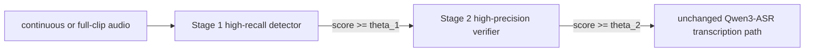

# VIGIL Two-Stage Trigger Smoke Pipeline

This folder contains a privacy-safe research pipeline for testing a two-stage VIGIL voice-trigger system on exported website data.



## Goal

The online system should not run the full Qwen3-ASR transcription path for every audio buffer.

The intended logic is:

```text
candidate = max_stage1_score >= theta_1
final_trigger = candidate AND stage2_score >= theta_2
```

Only if `final_trigger` is true should the original Qwen3-ASR model transcribe the full command audio.

## Data Labels

Transcript and trigger label are different.

- `audio: "VIGIL, go back."`
- ASR transcript target: `VIGIL, go back.`
- KWS trigger label: `1`

Prompt group mapping:

- `P1_vigil_only`: positive, transcript `VIGIL`
- `P2_phrase_plus_vigil`: positive, transcript contains exact word `VIGIL`
- `P3_vigil_plus_phrase`: positive, transcript contains exact word `VIGIL`
- `P4_negative`: negative, transcript must not contain exact word `VIGIL`

The Qwen ASR JSONL format is:

```json
{"audio":"/path/to/audio.wav","text":"language English<asr_text>VIGIL"}
```

Never put strings like `positive`, `negative`, `trigger`, or `non-trigger` in Qwen ASR transcript text.

## Stage 1

Stage 1 is not LoRA. It trains a new small classifier on frozen openWakeWord shared audio features.

Target architecture:

- official openWakeWord shared audio feature extractor
- frozen shared feature extractor
- LayerNorm
- two-layer unidirectional GRU
- linear binary head
- weighted `BCEWithLogitsLoss`

Conceptual BCE:

```text
L = -mean(y log(sigmoid(s)) + (1-y) log(1-sigmoid(s)))
```

Stage 1 threshold `theta_1` is selected only on validation predictions. It tries to meet 95% positive recall and then minimize false positives.

If official openWakeWord is not installed, the smoke script may run an explicitly marked acoustic FFT fallback only to test pipeline wiring. That fallback is not a scientific result.

## Stage 2

Stage 2 does not fine-tune Qwen. All Qwen parameters must remain frozen.

Target verifier:

- frozen Qwen3-ASR-1.7B audio encoder
- trainable projection
- masked temporal attention pooling
- trainable 128-dim embedding head
- trainable binary classifier

The verifier returns:

- binary trigger logit
- normalized embedding
- temporal attention weights

Stage 2 loss:

```text
L_stage2 = BCEWithLogitsLoss + lambda_supcon * supervised_contrastive_loss
```

Supervised contrastive phrase IDs:

- all positive VIGIL examples: `vigil`
- hard negative words: `visual`, `digital`, `individual`, etc.
- unknown background: `background`

`background` participates in BCE but is excluded from supervised contrastive loss.

## Speaker Split

The pipeline hashes participant/account identity and stores only deterministic short speaker hashes.

Split policy:

- 5+ speakers: speaker-disjoint train/val/test
- 3-4 speakers: one held-out validation speaker and one held-out test speaker
- 2 speakers: held-out test speaker, validation from training clips
- 1 speaker: engineering smoke clip split only

Exact duplicate audio hashes are never allowed to cross splits.

## Preprocessing

Each canonical clip is read once from `metadata/clips.jsonl` and `audio_raw/<clip_id>.*`.

The export has duplicate convenience views such as `raw_audio/` and `by_prompt_group/`; those are not counted as extra samples.

Audio conversion:

- 16 kHz
- mono
- signed 16-bit PCM WAV
- ffmpeg return code checked
- decoded WAV validated

Default training window: 2.0 seconds.

Window heuristics:

- P1: center speech
- P2: final speech window
- P3: initial speech window
- P4: center short clips or split long negatives

## Commands

Bootstrap environment:

```bash
make -C /home/hj/Data_Collect_Web/finetune bootstrap
```

Prepare only:

```bash
make -C /home/hj/Data_Collect_Web prepare DATA_ZIP=/path/to/export.zip
```

Smoke:

```bash
bash /home/hj/Data_Collect_Web/finetune/scripts/run_smoke.sh \
  /home/hj/Data_Collect_Web/finetune/data/vigil_dataset_export_20260620_020617.zip
```

Full dataset next week:

```bash
bash /home/hj/Data_Collect_Web/finetune/scripts/run_full.sh \
  /absolute/path/to/new_vigil_dataset_export.zip
```

Tests:

```bash
PYTHONPATH=/home/hj/Data_Collect_Web/finetune/src pytest -q /home/hj/Data_Collect_Web/finetune/tests
```

## Expected Files

Generated data is ignored by Git:

- `finetune/data/processed/<fingerprint>/manifest_all.jsonl`
- `train.jsonl`, `val.jsonl`, `test.jsonl`
- `qwen_asr_train.jsonl`, `qwen_asr_val.jsonl`, `qwen_asr_test.jsonl`
- `qc_report.jsonl`
- `rejected_or_inconsistent.jsonl`
- `dataset_report.json`
- `dataset_report.md`

Run artifacts are ignored by Git:

- `finetune/runs/<timestamp>_<fingerprint>_smoke/FINAL_REPORT.md`
- stage reports
- checkpoints
- cached features
- predictions

## Troubleshooting

CUDA:

- If `torch.cuda.is_available()` is false, Qwen3-ASR encoder extraction will be skipped.

Slurm:

- If `sbatch` is missing, run locally or submit on a GPU node manually.

ffmpeg:

- `ffmpeg` must be available for raw audio conversion.

Hugging Face downloads:

- Qwen model downloads are large. Use an existing cache when possible.

openWakeWord:

- Install official openWakeWord before treating Stage 1 metrics as scientific.

Qwen adapter changes:

- Qwen internal audio-encoder names may change. The adapter is intentionally version-checked.

Out of memory:

- Reduce Qwen feature extraction batch size to 1.

Tiny datasets:

- Smoke results are engineering-only and must not be reported as final scientific evidence.
